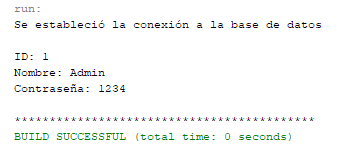

#  PROGRAMA DE JAVA QUE SE CONECTA A UNA BASE DE DATOS MYSQL

## Características

* Programa que prueba la conexión a una base de datos y ejecuta una consulta de selección.
* Programa de consola.

##  Consideraciones

* Uso de NetBeans 8.2
* Uso de OpenJDK 15.0.2
* Uso de la librería MySQL Connector (incluída en src)

## Capturas

